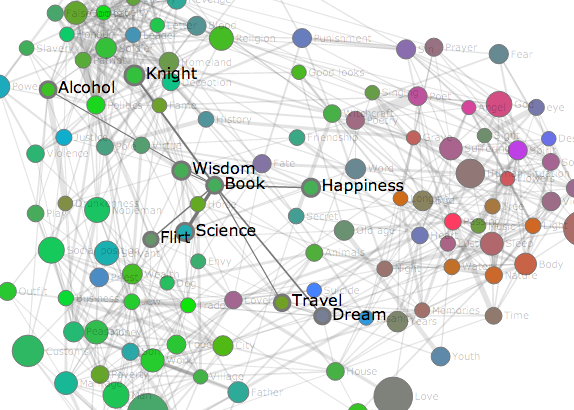

wizualizacja-wolnych-lektur
=========================

Motywy i kolory ze zbioru [Wolnych Lektur](http://wolnelektury.pl/) - wizualizacja w [D3.js](http://d3js.org/).

(Motifs and colours of "[Free Books](http://wolnelektury.pl/)", a visualization in [D3.js](http://d3js.org/).)

## Zawartość / Content

* [Motywy Wolnych Lektur](http://stared.github.com/wizualizacja-wolnych-lektur/motywy_wolnych_lektur.html) - mapa motywów literackich w postaci grafu (wierzchołki to 123 najczęściej występujących motywów, krawędzie - motywy często występujące razem).
* [Themes of Polish Books - an Interactive Map](http://stared.github.com/wizualizacja/wolnych-polish_books_themes.html) (English version of the above) - a graph where nodes are themes (or motifs), and links are their frequent co-occurrences. 
* [Kolory Wolnych Lektur](http://stared.github.com/wizualizacja-wolnych-lektur/kolory.html) - interaktywna eksploracja kolorów i odcieni występujących w lekturach.

## Co i jak?

### [Motywy](http://stared.github.com/wizualizacja-wolnych-lektur/motywy_wolnych_lektur.html) (Piotr Migdał)

[English version coming soon(er or later)]

Książki z Wolnych Lektur są opatrzone adnotacjami dotyczącymi występujących motywów (np. "Kobieta", "Bóg", "Sen"...). Zaciekawiło mnie zarówno jakimi, jak i - jakie kombinacje są szczególnie częste.

Wybrałem motywy, które występują co najmniej 200 razy, zliczyłem jak często występuje w zależności od rodzaju literackiego (tj. liryka, epika, dramat) oraz stworzyłem połączenia miedzy nimi na podstawie częstości współwystępowania motywów.

Tj. wszystkie połączenia między motywami są stworzone automatycznie, w oparciu o zbiór danych, bez ludzkiej ingerencji. Co więcej, połączone motywy mogą, ale nie muszą, być powiązane semantycznie. Daje to wgląd w połączenia i kompozycje tematyczne - zarówno te "narzucające się", jak i te, których nie sposób by się domyślić.

Dokładna wzór na współwystępowanie motywów (tu: `motyw1` i `motyw2`):
 
    \sum_i #motyw1(i) * #motyw2(i) / #motywy(i),

gdzie suma przebiega po wszystkich lekturach, `#motyw1(i)` to liczna wystąpień motywu `1` w lekturze `i` (analogicznie dla `#motyw2(i)`), `#motywy(i)` to całkowita liczba wystąpień motywów w danej lekturze. [Owa wielkość statystyczna](http://stats.stackexchange.com/questions/6047) przyjmuje wartość większą od 1 gdy motywy współwystępują częściej, niż tyle co "przez przypadek". Stąd też grubość krawędzi to owa wielkość minus jeden.

Niejako rozwinięcie mojego poprzedniego projektu, https://github.com/stared/tag-graph-map-of-stackexchange/wiki, w którym to patrzę na powiązania między tagami związanymi z programowaniem (a także dziedzinami fizyki, kognitywistyki i nie tylko).

### [Kolory](http://stared.github.com/wizualizacja-wolnych-lektur/kolory.html) (Marta Czarnocka-Cieciura, Piotr Migdał)

Jak przedstawić graficznie treść książki? Startując w konkursie na wizualizację Wolnych Lektur, postanowiliśmy skupić się na kolorystyce, a dokładniej wyłowić z tekstów wszelkie określenia dotyczące barw i przedstawić je w formie graficznej.

Opisy literackie nieraz obfitują w różnorodne i poetyckie określenia kolorów. Aby ich jak najmniej przeoczyć, skorzystaliśmy z bogatej [listy barw w języku polskim dostępnej na stronie Wikipedii](http://pl.wikipedia.org/wiki/Lista_kolor%C3%B3w). Miało to tę zaletę, że każdemu kolorowi jest na tam przypisana jego wartość RGB, określająca udział poszczególnych składowych (czerwonego, zielonego i niebieskiego).

Ściągniętą z Wikipedii listę kolorów musieliśmy nieco skorygować na potrzeby wizualizacji. Zmieniliśmy dwuwyrazowe nazwy, ciężkie do wyszukiwania w tekście. Usunęliśmy też mylące nazwy, jak np. "winny", kojarzący się bardziej z czyjąś winą, niż z barwą wina. Mimo to postanowiliśmy zostawić większość pochodzących od rzeczowników nazw kolorów, bo choć np. przymiotnik jagodowy może oznaczać raczej zawartość jagód, to jednak jest ona zwykle związana lub kojarzy się z charakterystyczną barwą. Oprócz tego dodaliśmy kolory dwuczłonowe, np. jasnoniebieski lub szarozielony, a ich wartości RGB wygenerowaliśmy z "wymieszania" odpowiednich kolorów składowych.

Kolejnym etapem było przeszukanie treści lektur. W tym celu policzyliśmy liczbę wystąpień poszczególnych słów w kolejnych tekstach, po czym w tej liście odnaleźliśmy nazwy kolorów. Tu pojawił się problem z gramatyką i nieregularnością języka polskiego. Na szczęście poratował nas internetowy [Słownik Języka Polskiego i dostępna na jego stronie lista słów wraz z odmianami](http://www.sjp.pl/slownik/odmiany/). Dzięki temu możliwe było sprowadzenie nazw kolorów do gramatycznej formy podstawowej i znalezienie jej w sporządzonej uprzednio liście barw.

Znalezione w lekturach kolory należało jeszcze przedstawić w formie graficznej. W tym celu nanieśliśmy koła o barwie odpowiadającej poszczególnym kolorom na [trójkąt Maxwella](http://pl.wikipedia.org/wiki/Tr%C3%B3jk%C4%85t_Maxwella). Jest to wykres, na którym odległości punktu od wierzchołków trójkąta odpowiadają udziałowi poszczególnych kolorów składowych: czerwonego, zielonego i niebieskiego. Ponieważ w ten sposób przedstawia się punkt o trzech współrzędnych na dwuwymiarowym wykresie, więc po drodze jakaś informacja musiała być utracona. Jest nią jasność koloru, czyli suma wartości R, G i B (z tego powodu np. kolor czarny i biały zajmują tę samą pozycję na trójkącie). Dlatego narysowaliśmy osobny wykres odpowiadający skali jasności barw. Na obu wykresach pole powierzchni kółek odpowiada liczbie wystąpień odpowiedniego słowa w tekście.

Jak nie trudno się domyślić, w dłuższych lekturach powinno wystąpić więcej słów określających kolory. Postanowiliśmy jednak nie przeliczać "zagęszczenia kolorów" w poszczególnych utworach, a zamiast tego wykonać osobny wykres obrazujący tę zależność. Ponieważ zarówno ogólna liczba słów, jak i ilość określeń dla barw była bardzo zmienna dla różnych lektur, więc aby obraz był czytelniejszy, zlogarytmowaliśmy obie osie. Przy okazji wykres ten służy jako pewnego rodzaju "spis treści": klikając na punkt odpowiadający danemu utworowi, można przejść do wizualizacji kolorów w tym tekście, jak również do linku do odpowiadającej mu strony w bibliotece Wolnych lektur.

Mamy nadzieję, że Czytelnikom przypadnie do gustu taki sposób wizualizacji Wolnych Lektur.

## Źródła i wykorzystane biblioteki

* [Wolne Lektury](http://wolnelektury.pl/)

* [Lista słów z odmianami - Słownik Języka Polskiego](http://www.sjp.pl/slownik/odmiany/)

* [Listy barw w języku polskim dostępnej na stronie Wikipedii](http://pl.wikipedia.org/wiki/Lista_kolor%C3%B3w)

* [Data-Driven Documents - D3.js](http://d3js.org/)
    * http://bl.ocks.org/mbostock/4062045
    * http://flowingdata.com/2012/08/02/how-to-make-an-interactive-network-visualization/
    * http://vallandingham.me/bubble_charts_in_d3.html
    * https://gist.github.com/anotherjavadude/2952964

* [Requests](http://docs.python-requests.org/)
* [Beautiful Soup](http://www.crummy.com/software/BeautifulSoup/)

## Licencja

* [Creative Commons Attribution 3.0 Unported](http://creativecommons.org/licenses/by/3.0/)
(nie dotyczy komponetnów, które mogą być objęte inną licencją)
